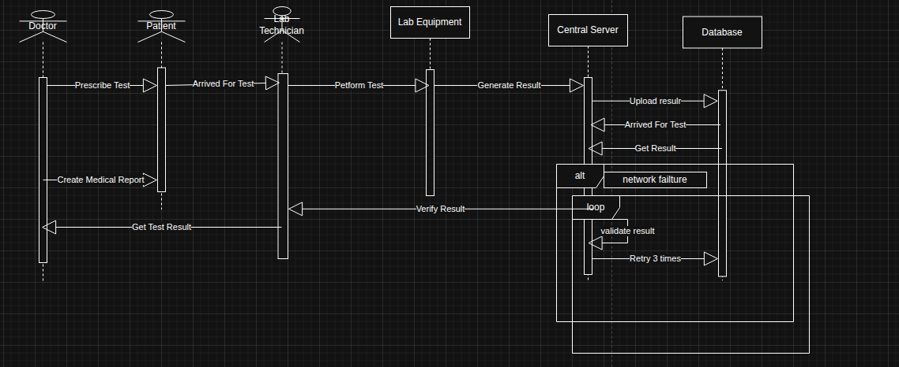

# Sequence Diagram – Cancer Examination and Result Processing

## Overview

This sequence diagram represents the process of conducting medical examinations for cancer detection, generating diagnostic results, transferring them to a central server, validating them, and storing them in the database.

The diagram includes alternative and loop fragments to model real-world system behavior such as network failures and retry mechanisms.

---

## Participants (Lifelines)

- **Doctor**
- **Patient**
- **Lab Technician**
- **Lab Equipment**
- **Central Server**
- **Database**

---

## Main Scenario

### 1. Examination Prescription

1. Doctor prescribes the test.
   - `Doctor → Patient : Prescribe Test`

2. Patient arrives for examination.
   - `Patient → Lab Technician : Arrived For Test`

---

### 2. Test Execution

3. Lab Technician performs the test using laboratory equipment.
   - `Lab Technician → Lab Equipment : Perform Test`

4. Lab Equipment generates examination results.
   - `Lab Equipment → Central Server : Generate Result`

---

### 3. Uploading Results

5. Lab Equipment uploads the generated result file to the Central Server.
   - `Central Server → Database : Upload result`

6. Database returns stored result confirmation.
   - `Database → Central Server : Get Result`

7. Central Server verifies the result.
   - `Central Server → Lab Technician : Verify Result`

---

### 4. Doctor Reviews Results

8. Doctor retrieves the test report.
   - `Doctor ← Patient : Get Test Result`

9. Doctor creates medical report.
   - `Doctor → Patient : Create Medical Report`

---

## Alternative Flow – Network Failure (alt)

The diagram includes an **alt combined fragment** to represent network issues during file upload.

### Condition: Network Failure

If a network failure occurs during upload:

- The system activates retry logic.

---

## Loop Fragment – Retry Mechanism

Inside the alternative flow:

- A **loop fragment** retries validation and upload up to 3 times.
